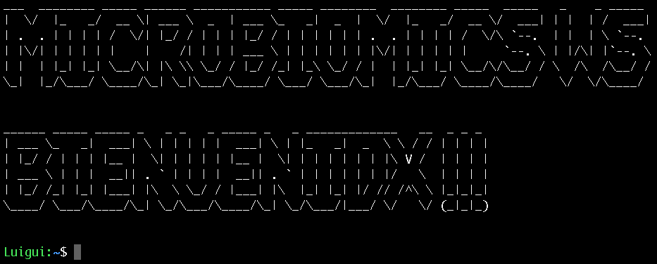

# Línea de comandos
## Shell
Los sistemas operativos tipo Unix incluyen una interfaz conocida como Shell, que facilita la comunicación con la computadora. Comúnmente, los términos Shell y terminal se utilizan de manera intercambiable para referirse a esta interfaz. Lo fundamental es que, a través del Shell, podemos interactuar y enviar instrucciones a nuestro sistema operativo.

## MobaXterm
MobaXterm es una herramienta que proporciona un entorno de terminal avanzado para Windows con funciones adicionales, incluyendo soporte para conexiones SSH, SFTP, X11, y muchas más. Aunque no es una terminal de Linux per se, ofrece funcionalidades que pueden ser muy útiles para desarrolladores y administradores de sistemas que necesitan interactuar con sistemas remotos.

* **Características clave de MobaXterm:**

* **Conexiones Remotas:** Facilita la conexión a servidores remotos mediante protocolos como SSH, Telnet, RDP, VNC, FTP, y SFTP.

* **Emulador de Terminal:** Ofrece un emulador de terminal completo con soporte para varias pestañas, resaltado de sintaxis, y capacidad de ejecutar comandos de Linux directamente en la consola.

* **Servidor X integrado:** Incluye un servidor X para permitir ejecutar aplicaciones gráficas de Linux en entornos remotos y mostrarlas en tu escritorio de Windows.

* **Herramientas de Red y Sistema de Archivos:** Proporciona herramientas integradas para la administración de redes y sistemas de archivos, facilitando tareas como la transferencia de archivos y la gestión de servicios.

* **Personalización:** Permite personalizar la apariencia y configuración del entorno de trabajo según tus preferencias.

:::info

Puedes usar una terminal de Linux en Windows mediante varias opciones. Estas son algunas de ellas:

* **Windows Subsystem for Linux (WSL):**

  * WSL 1: Puedes instalar WSL 1 a través de la característica de Windows denominada "Características de Windows" en "Activar o desactivar las características de Windows". Luego, puedes instalar una distribución de Linux desde la Microsoft Store.
  * WSL 2: WSL 2 es una versión más reciente y puede ofrecer un rendimiento mejorado. Debes habilitar WSL 2 en "Características de Windows" y luego instalar una distribución de Linux, como Ubuntu, desde la Microsoft Store.

* **Git Bash:**
  * Si ya tienes Git instalado, probablemente tengas Git Bash. Proporciona una terminal Bash en un entorno de Windows.

* **Cygwin:**

  * Cygwin es una colección de herramientas de software que proporciona una funcionalidad similar a una terminal de Linux en Windows. Puedes instalar Cygwin seleccionando las herramientas y paquetes deseados durante el proceso de instalación.

* **PuTTY:**

  * PuTTY es un cliente de terminal para conexiones SSH, pero también puedes usarlo para acceder a la línea de comandos de Linux. Necesitarás un servidor SSH en tu máquina remota (puede ser WSL o cualquier otra máquina Linux a la que tengas acceso).

* **Terminales basadas en consola (ConEmu, Windows Terminal):**
  * Puedes usar terminales de consola como ConEmu o la nueva Windows Terminal que permiten acceder a la línea de comandos de Linux.

Cada opción tiene sus propias ventajas y desventajas, así que la elección depende de tus preferencias y requisitos específicos. WSL es una opción cada vez más popular debido a su integración profunda con Windows y su rendimiento generalmente sólido.

:::