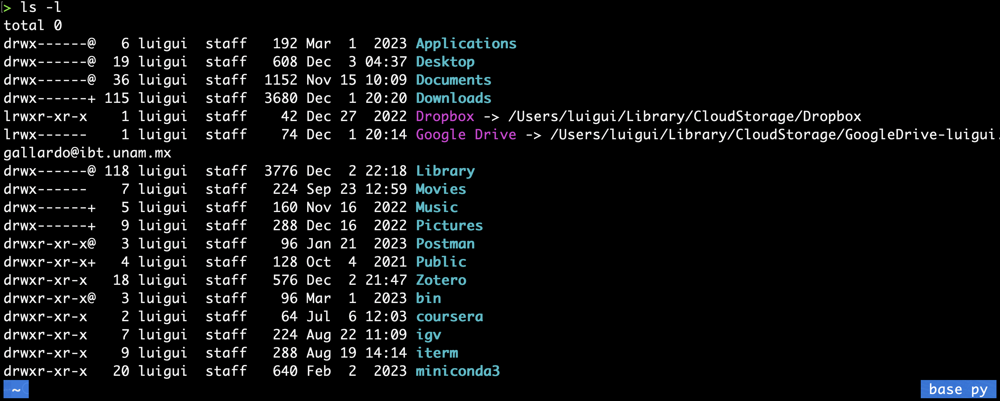

# Cambiar permisos con `chmod`
Cuando examinamos el contenido de un directorio mediante el comando `ls -l`, notamos que la salida se organiza en siete columnas. Nos centraremos en detallar la primera columna (observar la siguiente imagen), que proporciona información crucial sobre los permisos de los archivos. Estos permisos determinan la capacidad de los usuarios para leer (*read*), modificar (*write*) y ejecutar los archivos. Esta información se vuelve especialmente relevante en entornos de servidores compartidos, donde se busca otorgar permisos específicos a usuarios particulares. En tales entornos, es común encontrar grupos de trabajo que comparten permisos sobre archivos específicos. Además, existe la posibilidad de otorgar permisos a todos los usuarios, permitiéndoles modificar los archivos según sea necesario.

La primera columna consiste en 10 caracteres:



Los tres primeros caracteres (rwx) corresponden al propietario, indicando los permisos de lectura (r), escritura (w) y ejecución (x). Los siguientes tres guiones (---) se aplican al grupo, denotando la ausencia de permisos. Por último, los últimos tres caracteres (---) representan los permisos para todos los usuarios, también indicando que no se tienen permisos de lectura, escritura ni ejecución.

```bash
d rwx --- ---     

d=      #Indica que el archivo es un directorio
r=      #Indica que el propietario puede tener acceso a este archivo (read)
w=      #Indica que el propietario puede modificar este archivo (read)
x=      #Indica si el archivo es ejecutable (execute)

```

## Notación octal de permisos
La notación octal de permisos es una forma compacta de representar y establecer permisos en archivos y directorios utilizando números en base octal (base 8). Los permisos en esta notación se dividen en tres grupos, cada uno de ellos representando los permisos para el propietario, el grupo y otros usuarios.

Cada permiso tiene un valor numérico asociado:

```bash
r (lectura): 4
w (escritura): 2
x (ejecución): 1
```

Al sumar estos valores, se obtiene un número octal que representa los permisos combinados para cada grupo. Por ejemplo:

```bash
rwx (lectura, escritura y ejecución): 4 + 2 + 1 = 7
rw- (lectura y escritura, sin ejecución): 4 + 2 = 6
r-- (lectura sin escritura ni ejecución): 4
--x (ejecución sin lectura ni escritura): 1
```

La notación octal de permisos utiliza tres dígitos, donde cada dígito representa uno de los grupos mencionados anteriormente (propietario, grupo, otros). Por ejemplo, el permiso `rw-r--r--` se representaría como `644` en notación octal, ya que el propietario tiene permisos de lectura y escritura (6), mientras que el grupo y otros solo tienen permisos de lectura (4).

Para aplicar permisos con notación octal utilizando el comando chmod, simplemente proporciona el número octal como argumento. Por ejemplo:

```bash
chmod 755 archivo
```
Esto dará permisos de lectura, escritura y ejecución al propietario (7), y permisos de lectura y ejecución a grupo y otros (5).

El comando `chmod` nos permite modificar los permisos a los archivos. Estos son algunos ejemplos de como utilizar este comando.

## Agregar permiso de ejecución al propietario:
```bash
chmod +x archivo
```

## Quitar permiso de escritura al grupo:

```bash
chmod g-w archivo
```

Otorgar permisos de lectura, escritura y ejecución a todos los usuarios:

```bash
chmod a+rwx archivo
```


## Establecer permisos específicos utilizando la notación octal

Por ejemplo: `rwx` para propietario, `r-x` para grupo, `---` para otros):

```bash
chmod 751 archivo
```

## Copiar los permisos de un archivo a otro:

```bash
chmod --reference=archivo_existente archivo_destino
```

Estos son solo ejemplos básicos y puedes ajustar los comandos según tus necesidades específicas. Recuerda que es importante comprender la estructura de los permisos (lectura, escritura, ejecución) y la notación octal para utilizar eficientemente el comando chmod.