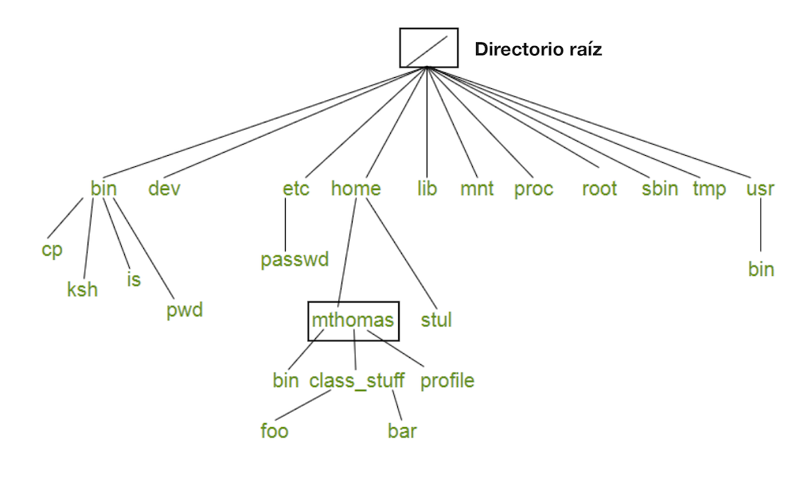

# Organización de archivos y directorios en linux

En Linux la organización de los directorios (conocidos como carpetas o folders en windows), siguen una jerarquía, por lo tanto, todo archivo o directorio creado en Linux estará a su vez contenido dentro de un directorio principal denominado root (raíz), este se representa por el símbolo /. Dentro del directorio root. / vamos a encontrar niveles, cada uno de estos niveles representa un directorio. Algunos de estos directorios tienen nombres preestablecidos y contienen archivos que el sistema necesita para funcionar correctamente, por lo que no debemos modificarlos Figura 3.

Figura 4. Organización jerárquica de los directorios en Linux. El directorio “mthomas” está dentro del directorio “home” que a su vez esta dentro del directorio raíz.

Algunos directorios ya establecidos por Linux son:

/bin Contiene comandos y utilidades

/dev Contiene archivos de dispositivos conectados al sistema

/etc Contiene comandos y archivos usados en la administración del Sistema

/lib Librerías que son utilizadas por diferentes programas o lenguajes

/proc Contiene información sobre los procesos

/tmp Archivos temporales creados por algunos programas

/sr Aquí se encuentran las aplicaciones instaladas por el usuario

/home Es el directorio de cada uno de los usuarios aquí están tus archivos, musica, videos etc

## Tipos de archivos
Archivos regulares: También se les llama archivos de texto, este documento por ejemplo sería un archivo regular.

Archivos ejecutables: Se refiere a programas, tambien conocidos como scripts, ellos ejecutan tareas especificas.

Directorios: Los conocemos también como folders o carpetas. Utilizaremos el nombre de directorios para referirnos a ellos.

Algo importante a considerar es que en Linux todo es un archivo. 