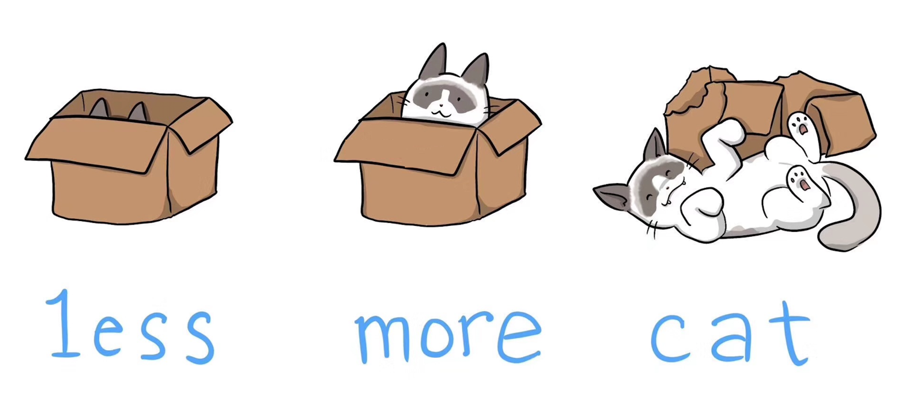
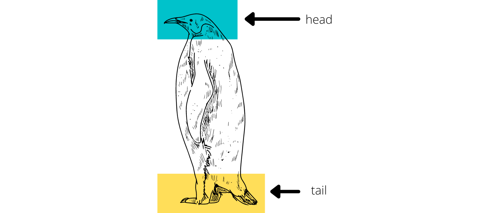

# Visualización de archivos

Si bien podemos visualizar los archivos con `nano`, si no deseamos editar el archivo, queremos ver una fracción del archivo o es un archivo pequeño que queremos visualizar, podemos utilizar `less`, `more` y `cat`. 



## Comando `less`
El comando `less` está basado en su antecesor `more` pero con características adicionales. Una de las más notorias es que ejecuta una pantalla en donde se visualiza el contenido del archivo.

Se utiliza comúnmente para revisar archivos con contenido extenso, ya que muestra una página a la vez, únicamente la pantalla que se muestra al usuario. Esto significa que no tiene que cargar todo el archivo antes de comenzar a mostrar su contenido. Al sallir del visualizador se limpia todo lo que `less` muestra.

Visualización de `archivo.txt`:

```bash
less archivo.txt
```

## Comando `more`
El comando `more` es de los más antiguos y a su vez sigue siendo de los más utilizados. Una de sus características notorias es que imprime el contenido del archivo leido en la pantalla de comandos.

Visualización del archivo `archivo.txt`:

```bash
more archivo.txt
```

## Similitudes entre `less` y `more`.
`less` y `more` comparten varias operaciones básicas y comunes en sus funcionalidades. Aquí hay algunas operaciones compartidas:

* **Desplazamiento Vertical:**
  * `Space` o` Barra espaciadora`: Avanzar una página.
  * `Enter`: Avanzar una línea.

* **Desplazamiento Vertical Inverso:**
  * `b`: Retroceder una página (en less también puede ser utilizado para retroceder una pantalla).

* **Desplazamiento Horizontal:**
  * **Flechas arriba y Flechas abajo:** Desplazarse hacia arriba o hacia abajo línea por línea.

* **Búsqueda de Texto:**
    * `/`: Iniciar búsqueda hacia adelante.
    * `?`: Iniciar búsqueda hacia atrás.
    * `n`: Ir a la siguiente coincidencia de búsqueda.
    * `N`: Ir a la coincidencia de búsqueda anterior.


* **Salir:**
  * `h`: Salir del visor y regresar al terminal.

* **Ayuda:**
  * `h`: Mostrar información de ayuda.

Estas operaciones proporcionan la funcionalidad básica para la navegación y exploración de archivos de texto en ambos visores. Aunque `less` amplía estas operaciones ofreciendo más funciones, las mencionadas son comunes tanto en `less` como en `more`.

## Comando `cat`
Al igual que los comandos ya mencionados, si se desea ver una fracción o la totalidad de un archivo podemos utilizar `cat`, `head` y `tail`. El comando `cat` es utilizado para leer archivos de forma concatenada, esto quiere decir, que muestra varios archivos al mismo tiempo, uno tras otro. Esta característica puede ser de utilidad cuando se quiere comparar el contenido de archivos cortos. Es un visualizador que imprime todo el contenido de uno o varios archivos a la vez en la pantalla.

Imprimir en pantalla todo el contenido del archivo:

```bash
cat archivo.txt
```

Imprimir todo el contenido de los tres archivos en el orden que se mencionan:

```bash
cat archivo1.txt archivo2.txt archivo3.txt 
```

No es recomendable utilizarlo con archivos extensos, ya que imprime en pantalla todo su contenido hasta su fin, y no permite su navegación.

## Comando `head`

Los comandos `head` y `tail` nos permiten visualizar respectivamente el inicio y el final del contenido de un archivo, de manera análoga a la cabeza y la cola de un pingüino.



`head` imprime las primeras lineas del contenido del archivo. Por defecto imprime 10 líneas, pero puede modificarse el número con la opción `-n`.

Para imprimir las primeras lineas (10 por defecto):

```bash
head archivo1.txt
```

Para imprimir solo las primeras 5 líneas:

```bash
head -n 5 archivo1.txt   
```

## Comando `tail`

Imprime las últimas lineas del contenido del archivo. Por defecto imprime 10 líneas, pero puede modificarse el número con la opción `-n`.

Para imprimir últimas lineas (10 por defecto):

```bash
tail archivo.txt
```

Ahora considerando las ultimas 3 líneas:

```bash
tail -n 3 archivo.txt  
```
