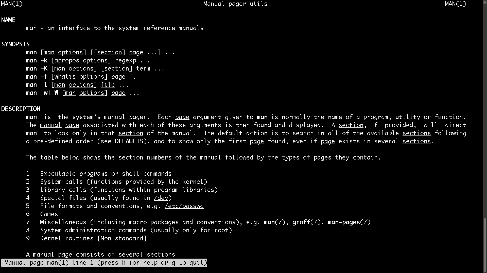

# Comandos
Un comando representa el nombre de un programa particular, cada uno con una tarea específica. Por ejemplo, al introducir el comando `date` en la terminal, obtendremos la fecha y la hora actuales. Es crucial tener en cuenta que los comandos pueden tener opciones, las cuales se añaden precediendo al nombre del comando.

## `man`
Cada comando tiene un manual para el usuario al que se puede acceder con el comando `man`. Por ejemplo:

```bash
man man
```


