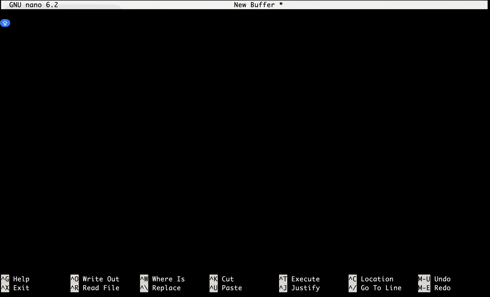

# Editor de texto `nano`

Nano es un editor de texto en modo de terminal, diseñado para ser simple y fácil de usar, especialmente para usuarios novatos o aquellos que prefieren una interfaz más intuitiva. Algunas características clave de Nano incluyen:

* **Interfaz Amigable:** Nano presenta una interfaz de usuario simple y amigable, con comandos básicos que se muestran en la parte inferior de la pantalla para facilitar su uso.

* **Atajos de Teclado Intuitivos:** Utiliza atajos de teclado comunes, como Ctrl + O para guardar y Ctrl + X para salir, lo que facilita la navegación y la ejecución de acciones.

* **Resaltado de Sintaxis:** Proporciona resaltado de sintaxis básico para diversos lenguajes de programación, lo que mejora la legibilidad del código.

* **Funciones Básicas de Edición:** Ofrece funciones esenciales de edición de texto, como copiar, pegar, cortar, buscar y reemplazar.

* **No Requiere Modo de Comandos:** A diferencia de algunos editores de texto en modo de terminal, Nano no requiere que ingreses a un "modo de comandos" separado para realizar acciones de edición.

* **Tamaño de Archivo Pequeño:** Nano tiene un tamaño de archivo relativamente pequeño, lo que lo hace rápido de cargar y utilizar en sistemas con recursos limitados.

En la pantalla de nano nosotros podemos escribir lo que deseemos. Algunos de los comandos que se utilizan dentro del editor son:

* **Ctrl+G:** Nos imprime la ayuda del programa.
* **Ctrl+O:** Guarda los cambios realizados.
* **Ctrl+X:** Salir del programa.
* **Alt+U:** Deshacer las últimas modificaciones hechas.

**Ejercicio:**

Abrir nano, escribir `Mi primer linea en texto plano` y guardar el texto (`Ctrl + O`), te pedira un nombre, escribelo y posteriormente da enter. Ahora cierra nano (`Ctrl + X`).