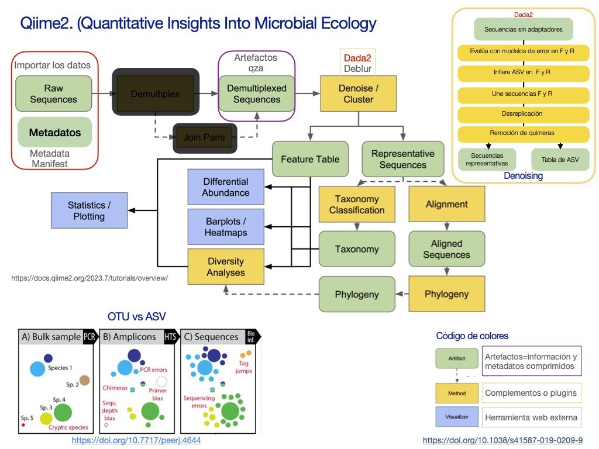

# Introducción QIIME 2

**Qiime2** (Quantitative Insights Into Microbial Ecology) es un *pipeline* desarrollado para el análisis de metataxonomía ([Bolyen et al., 2019](https://www.nature.com/articles/s41587-019-0209-9)). Contiene herramientas para limpiar secuencias, agrupar, asignar taxonomía, reconstruir filogenias, inferir métricas de diversidad, abundancia diferencial, etc. Es de código abierto, posee una [interfaz gráfica](https://view.qiime2.org/) amigable, [mucha documentación](https://docs.qiime2.org/2022.11/plugins/available/diversity/), [tutoriales](https://docs.qiime2.org/2023.7/tutorials/) y [foros de ayuda](https://forum.qiime2.org/).

Recordemos el flujo de análisis que se pueden hacer dentro de este *pipeline*.

## Los datos

<!-- Para este taller trabajaremos con datos de amplicones de la región V3-V4 del 16S rRNA de muestras de tres tiempos de fermentación del **pulque**, estos se obtuvieron con una plataforma ILLUMINA MiSeq (2 x 300 pb) y están en formato FASTQ. Los datos fueron depositados en NCBI y ENA bajo el BioProject **PRJEB13870** del artículo **[Deep microbial community profiling along the fermentation process of pulque, a biocultural resource of Mexico](https://www.sciencedirect.com/science/article/pii/S0944501320304614#sec0010)** (Rocha-Arriaga et al., 2020). -->

NOTA: Cada programa tiene una ayuda y un manual de usuario, es importante revisarlo y conocer cada parámetro que se ejecute. En terminal se puede consultar el manual con el comando man y también se puede consultar la ayuda con -h o --help, por ejemplo qiime tools import --help.

La presente práctica sólo es una representación del flujo de trabajo para el análisis de amplicones, sin embargo, no sustituye a los manuales de cada programa y el flujo puede variar dependiendo del tipo de datos y pregunta de investigación. Una explicación mucho más detallada de cada paso se encuentra en el overview y en el moving-pictures de QIIME2.